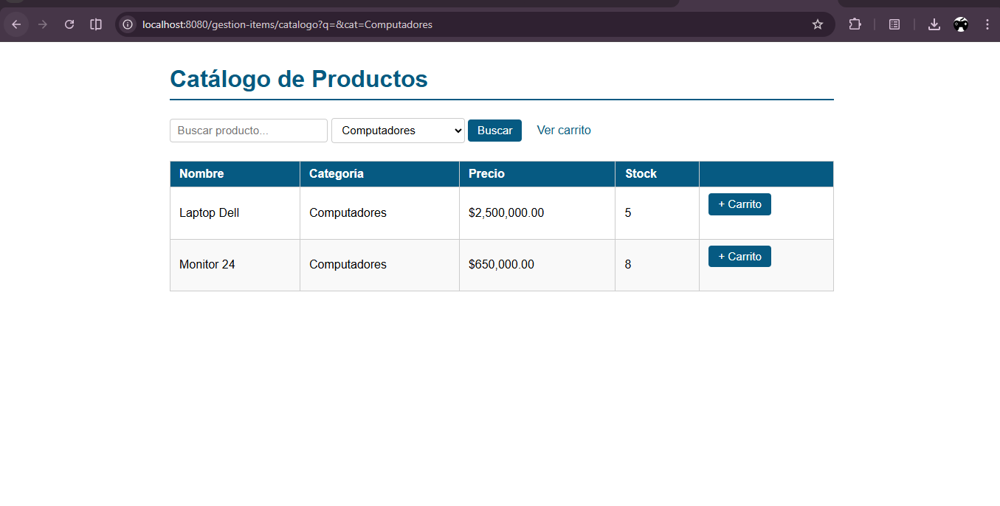
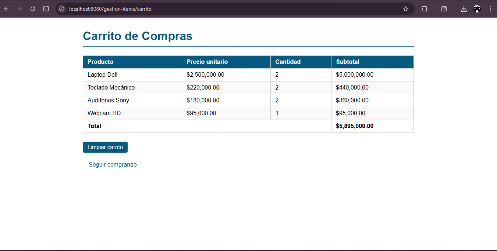
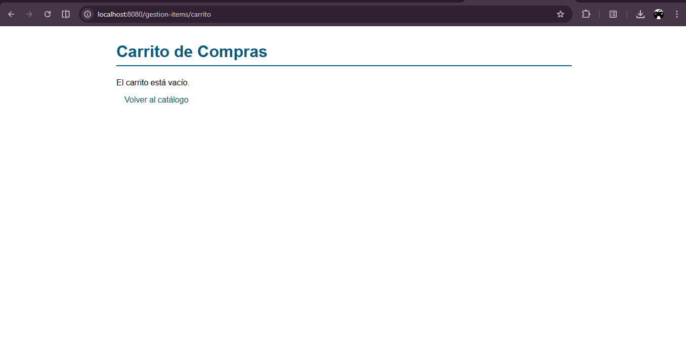

# Proyecto: Catálogo Web

Este proyecto es una aplicación web Java (WAR) sencilla que expone un catálogo de productos, un carrito de compras en sesión y una página de confirmación.

Requisitos
- Java 17
- Maven 3.6+
- Un contenedor de servlets compatible con Jakarta EE 9+/Jakarta Servlet 6 (por ejemplo Tomcat 10.1+)

Compilar y empaquetar

1. Abrir una terminal en la carpeta raíz del proyecto (donde está `pom.xml`).
2. Ejecutar:

```bash
mvn clean package
```

El comando genera un artefacto WAR en `target/catalogo-web-1.0-SNAPSHOT.war` (o `target/*.war` según `artifactId/version`).

Desplegar en Tomcat

1. Copiar el WAR generado a la carpeta `webapps` de Tomcat, por ejemplo:

```bash
# Windows (PowerShell)
Copy-Item -Path target\catalogo-web-1.0-SNAPSHOT.war -Destination "C:\path\to\tomcat\webapps\"

# Linux/macOS (bash)
cp target/catalogo-web-1.0-SNAPSHOT.war /path/to/tomcat/webapps/
```

2. Iniciar o reiniciar Tomcat.
3. Abrir el navegador en `http://localhost:8080/catalogo-web-1.0-SNAPSHOT/` (ajusta el contexto si tu WAR tiene otro nombre).

Ejecución rápida para desarrollo (opcional)

Si prefieres evitar desplegar manualmente, puedes usar un plugin o ejecutar un servidor embebido; sin embargo este proyecto no incluye un main embebido por defecto. La manera estándar es desplegar el WAR en Tomcat u otro contenedor.

Verificar que la aplicación sirve

- Página principal: `http://localhost:8080/<context>/` redirige al catálogo.
- Catálogo: `http://localhost:8080/<context>/catalogo` — muestra búsqueda, filtro por categoría y botones para añadir al carrito.
- Carrito: `http://localhost:8080/<context>/carrito` — muestra los items en sesión.

Pruebas visuales (capturas de muestra)

Se incluyen imágenes en la carpeta `multimedia/` que puedes abrir localmente para verificar visualmente el funcionamiento de filtros y carrito. Imágenes incrustadas a continuación:






